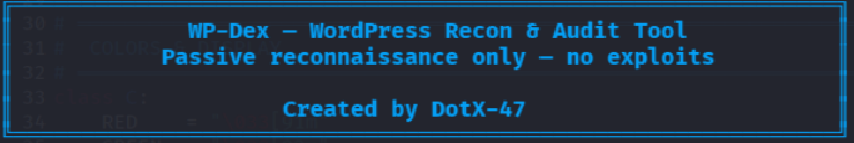
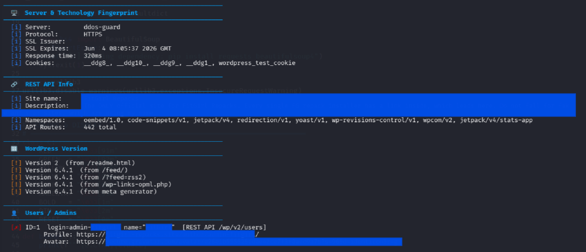
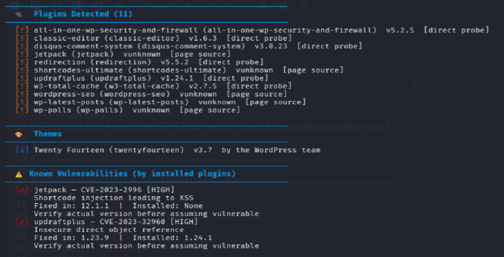
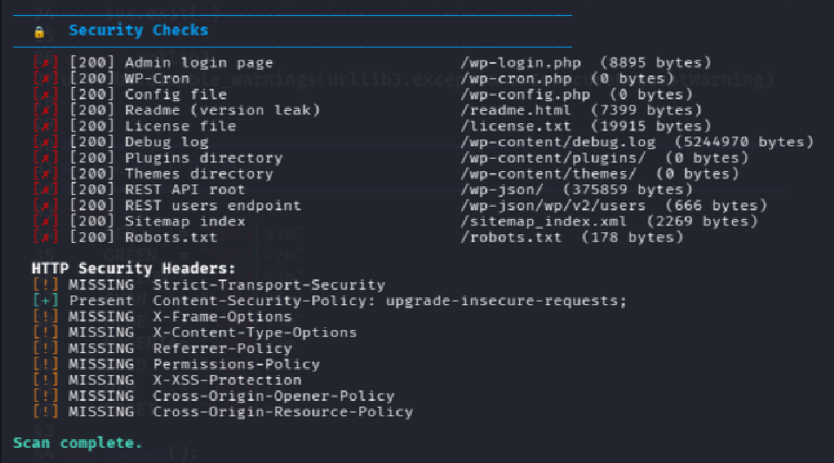
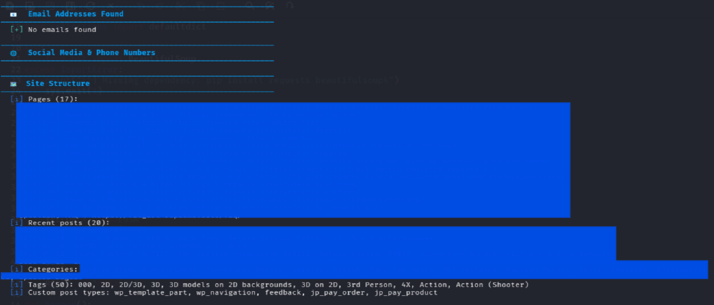

# 🛡️ WP-Dex — Advanced WordPress Passive Recon Tool

> 🛡️ WP-Dex — расширенный инструмент для пассивной разведки WordPress

---

<p align="center">
  
  
  
  
</p>

---

> ⚡ Deep reconnaissance • Passive scanning • Zero exploitation  
> WP-Dex is a powerful Python-based tool designed to gather detailed intelligence about WordPress websites without modifying or attacking the target.

---

> ⚡ Глубокая разведка • Пассивное сканирование • Отсутствие эксплуатации
> WP-Dex — это мощный инструмент на основе Python, предназначенный для сбора подробной информации о веб-сайтах WordPress без модификации или атаки на целевой сайт.

---

## 📸 Preview
> 📸 Предварительный просмотр

### 🔍 Banner
> 🔍 Баннер


---

### 🔍 Scan Output
> 🔍 Результаты сканирования


---

## 🚀 What is WP-Dex?
> 🚀 Что такое WP-Dex?

WP-Dex is a passive reconnaissance tool built for security researchers, developers, and ethical hackers.  
It collects publicly accessible data from WordPress websites and presents it in a structured, readable format.

Unlike aggressive tools, WP-Dex does NOT exploit vulnerabilities — it only reveals what is already exposed.

> WP-Dex — это инструмент пассивной разведки, созданный для исследователей в области безопасности, разработчиков и этичных хакеров.
> Он собирает общедоступные данные с веб-сайтов WordPress и представляет их в структурированном, удобочитаемом формате.
>
> В отличие от агрессивных инструментов, WP-Dex НЕ использует уязвимости — он лишь выявляет уже существующие уязвимости.
---

### 🔍 Scan Output
> 🔍 Результаты сканирования


---

## 🧠 What Does It Do?
> 🧠 Что это делает?

### 🔎 WordPress Detection
Confirms if a target is running WordPress using multiple indicators.

> 🔎 Обнаружение WordPress
> Подтверждает, работает ли целевая система на WordPress, используя несколько индикаторов.

### 🖥️ Server & Technology Fingerprinting
Detects server type, PHP version, CDN/WAF, and technologies like jQuery, Bootstrap, WooCommerce, Elementor.

> 🖥️ Идентификация серверов и технологий
> Определяет тип сервера, версию PHP, CDN/WAF и такие технологии, как jQuery, Bootstrap, WooCommerce, Elementor.

### 🔢 WordPress Version Detection
Extracts version from meta tags, feeds, readme files, and scripts.

> 🔢 Определение версии WordPress
> Извлекает версию из метатегов, RSS-лент, файлов README и скриптов.

### 👤 User Enumeration
Discovers usernames via REST API, author ID, sitemaps, and oEmbed.

> 👤 Перечисление пользователей
> Получает имена пользователей через REST API, идентификатор автора, карты сайта и oEmbed.

### 📧 Email Harvesting
Extracts emails from page content and mailto links.

> 📧 Сбор адресов электронной почты
> Извлекает адреса электронной почты из содержимого страницы и ссылок mailto.

### 🔌 Plugin Detection
Finds plugins via source analysis, probing, and database matching.

> 🔌 Обнаружение плагинов
> Находит плагины посредством анализа исходного кода, поиска и сопоставления с базой данных.

### 🎨 Theme Detection
Identifies themes and extracts metadata like version and author.

> 🎨 Определение темы
> Выявляет темы и извлекает метаданные, такие как версия и автор.

### 🗺️ Site Structure Mapping
Maps pages, posts, categories, tags, and menus.

> 🗺️ Составление карты структуры сайта
> Страницы с картами, записи, категории, теги и меню.

### 🌐 Social & Contact Info
Extracts social profiles and phone numbers.

> 🌐 Социальные сети и контактная информация
> Извлекает профили в социальных сетях и номера телефонов.

### ⚠️ Vulnerability Matching
Matches plugins with known CVEs using offline database.

> ⚠️ Сопоставление уязвимостей
> Сопоставляет плагины с известными уязвимостями CVE, используя автономную базу данных.

### 🔒 Security Checks
Checks exposed paths and analyzes HTTP security headers.

> 🔒 Проверки безопасности
> Проверяет открытые пути и анализирует заголовки безопасности HTTP.

---

### 🔍 Scan Output
> 🔍 Результаты сканирования


---

## ⚙️ Installation
> ⚙️ Установка

```bash
git clone https://github.com/DotX-47/WP-Dex.git
cd WP-Dex
pip install requests beautifulsoup4
```

---

## ▶️ Usage

```bash
python WP-Dex https://example.com
```

---

### 🔍 Scan Output
> 🔍 Результаты сканирования


---

## 📂 Output

- Terminal (structured output)
- JSON report (optional)

> 📂 Вывод
>
> - Терминал (структурированный вывод)
> - Отчет в формате JSON (необязательно)

---

## ⚠️ Disclaimer

Use only on websites you own or have permission to test.

## ⚠️ Отказ от ответственности

Используйте только на сайтах, которые принадлежат вам или на тестирование которых у вас есть разрешение.

---

## 👨‍💻 Author
> ## 👨‍💻 Автор

DotX-47
